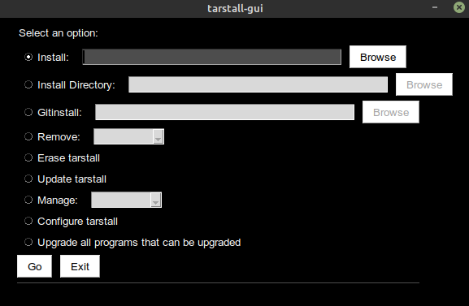

# tarstall

Feature-rich package management for archives!




tarstall is a lightweight package manager for Linux (and similar) systems that manages programs stored in archives, programs stored as directories, and remote git repositories! It's built off of Python 3 and currently manages .zip, .7z, .rar, .tar.gz, and .tar.xz archives, directories, and git repositories! It has an array of features besides the typical installing/uninstalling including path management, .desktop creation, alias creation (binlinks), and program updating through git and user-provided upgrade scripts!

## Notable Features
* Ability to install and uninstall many different archive types
* A CLI interface and a GUI interface
* .desktop file creation
* Ability to keep itself up to date

## Getting Started
On a system with wget, run the following command: ```wget https://raw.githubusercontent.com/hammy3502/tarstall/master/install_tarstall && python3 install_tarstall```. You may need to enter your root password to install some of the dependencies for tarstall.

NOTE: Dependencies should be installed manually if you're on a system that doesn't use `apt`, `apt-get`, `dnf`, or `pacman`! You'll need to get ahold of `git`, `wget`, and `python3-tk` (tkinter for Python 3). From there, you can run the command above, and everything else will be taken care of for you!

## More Info
Tons of more information is provided in the Wiki. The [Basic Usage section of the wiki](https://github.com/hammy3502/tarstall/wiki/Basic-Usage) provides examples, usage, etc. for most commands while the [Features section of the wiki](https://github.com/hammy3502/tarstall/wiki/Features) details all of the features of tarstall.
